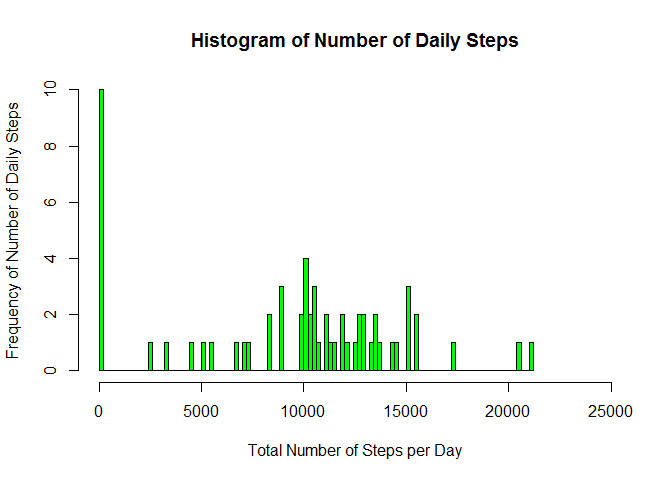
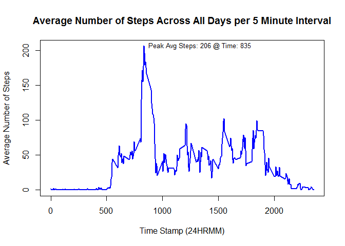
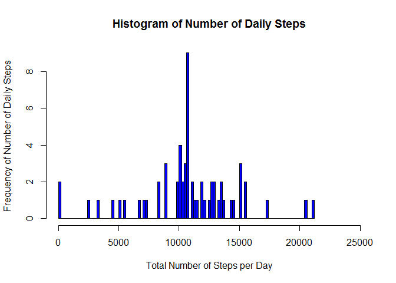
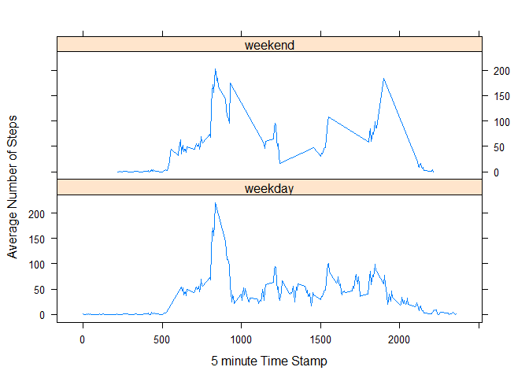

# Reproducible Research: Peer Assessment 1


## Loading and preprocessing the data
####Show any code that is needed to

##### 1) Load the data (i.e. read.csv())
##### 2) Process/transform the data (if necessary) into a format suitable for your analysis


```r
##  Get necessary packages loaded
        if(!require(tidyr)){install.packages("tidyr")}
```

```
## Loading required package: tidyr
```

```r
        library(tidyr)
        if(!require(dplyr)){install.packages("dplyr")}
```

```
## Loading required package: dplyr
## 
## Attaching package: 'dplyr'
## 
## The following object is masked from 'package:stats':
## 
##     filter
## 
## The following objects are masked from 'package:base':
## 
##     intersect, setdiff, setequal, union
```

```r
        library(dplyr)
        if(!require(lubridate)){install.packages("lubridate")}
```

```
## Loading required package: lubridate
```

```r
        library(lubridate)
        if(!require(lattice)){install.packages("lattice")}
```

```
## Loading required package: lattice
```

```r
        library(lattice)


## little functions annoying but necessary  b/c I haven't been able to find a better way
        as.numeric.factor <- function(x) {as.numeric(levels(x))[x]}


##  pull down a fresh dataset if it doesn't already exist in your working directory
##  Load the data & process    
        dataset_url <-"https://d396qusza40orc.cloudfront.net/repdata%2Fdata%2Factivity.zip"
        if(!file.exists("Dataset.zip")){
                        download.file(dataset_url, destfile="Dataset.zip")}
        if(!file.exists("activity.csv")){
                        unzip("Dataset.zip", overwrite= TRUE)}
        if(!exists("activity")){       
                        activity <- read.csv("activity.csv", sep = ",")}

        dateDownloaded <- date()
        cat("Data file downloaded & evaluated ", dateDownloaded," from ", dataset_url)
```

```
## Data file downloaded & evaluated  Mon Feb 09 09:54:53 2015  from  https://d396qusza40orc.cloudfront.net/repdata%2Fdata%2Factivity.zip
```


## What is mean total number of steps taken per day?
####For this part of the assignment, you can ignore the missing values in the dataset.

##### 1)  Calculate the total number of steps taken per day

```r
        TotalbyDay<-aggregate(activity$steps, list(Day=activity$date), FUN = sum, na.rm=TRUE)
        names(TotalbyDay)<-c("Day", "TotalSteps")
        head(TotalbyDay)
```

```
##          Day TotalSteps
## 1 2012-10-01          0
## 2 2012-10-02        126
## 3 2012-10-03      11352
## 4 2012-10-04      12116
## 5 2012-10-05      13294
## 6 2012-10-06      15420
```


##### 2)  If you do not understand the difference between a histogram and a barplot, research the difference between them. Make a histogram of the total number of steps taken each day

```r
       hist(TotalbyDay$TotalSteps, col = "green", breaks = 100 
             ,xlab = c("Total Number of Steps per Day")
             ,xlim = c(0,25000)
             , ylab = c("Frequency of Number of Daily Steps")
             ,main = "Histogram of Number of Daily Steps"
        )
```

 


##### 3)  Calculate and report the mean and median of the total number of steps taken per day


```r
        sum1<- as.data.frame(rbind(
                c("Total Number of Steps", sum(TotalbyDay$TotalSteps)),
                c("Mean Number of Steps", trunc(mean(TotalbyDay$TotalSteps))),
                c("Median Number of Steps", median(TotalbyDay$TotalSteps))
        ))
        colnames(sum1)<-c("Description", "Number")
        print(sum1)
```

```
##              Description Number
## 1  Total Number of Steps 570608
## 2   Mean Number of Steps   9354
## 3 Median Number of Steps  10395
```


## What is the average daily activity pattern?

##### 1)Make a time series plot (i.e. type = "l") of the 5-minute interval (x-axis) and the average number of steps taken, averaged across all days (y-axis)

```r
        AvgbyInterval<-aggregate(activity$steps, list(interval=activity$interval)
                                         , FUN = mean, na.rm=TRUE)
                names(AvgbyInterval)<-c("interval", "AvgSteps")
        x<- which.max(AvgbyInterval$AvgSteps)
        maxAvg<-AvgbyInterval[x,]
        label <- paste("Peak Avg Steps:",trunc(maxAvg$AvgSteps),"@ Time:"
                       ,trunc(maxAvg$interval))

        plot(AvgbyInterval$interval,AvgbyInterval$AvgSteps, type = "l"
             , col = "blue", lwd = 2
             ,xlab = "Time Stamp (24HRMM)"
             ,ylab = "Average Number of Steps"
        )
             title("Average Number of Steps Across All Days per 5 Minute Interval")
             text (maxAvg$interval+500, maxAvg$AvgSteps, label, cex = 0.8)
```

 

```r
       # dev.copy(png, file = "Plot1.png", width = 480, height = 480)
```

##### 2)Which 5-minute interval, on average across all the days in the dataset, contains the maximum number of steps?

```r
        print(paste("Time:",maxAvg$interval))
```

```
## [1] "Time: 835"
```

## Imputing missing values
####Note that there are a number of days/intervals where there are missing values (coded as NA). The presence of missing days may introduce bias into some calculations or summaries of the data.
        
##### 1) Calculate and report the total number of missing values in the dataset (i.e. the total number of rows with NAs)


```r
        nrow(activity)
```

```
## [1] 17568
```

```r
        colSums(is.na(activity))
```

```
##    steps     date interval 
##     2304        0        0
```


##### 2)Devise a strategy for filling in all of the missing values in the dataset. The strategy does not need to be sophisticated. For example, you could use the mean/median for that day, or the mean for that 5-minute interval, etc.

        Since I've already calculated the mean for the 5-minute intervals, I'll 
        recycle that data for the strategy by merging the AvgbyInterval.AvgSteps
        with the data from activity.


##### 3)Create a new dataset that is equal to the original dataset but with the missing data filled in.

```r
        activity2<-merge(activity, AvgbyInterval, by.x = "interval")
        remove<-subset(activity2, is.na(steps))
        remove<-remove[,c(1,4,3)]
        colnames(remove)<-c("interval", "steps","date")
        
        keep<-subset(activity2, !is.na(steps))
        keep<-keep[,1:3]
        
        activity.imputed<-rbind(keep, remove)

        nrow(activity.imputed)
```

```
## [1] 17568
```

```r
        colSums(is.na(activity.imputed))
```

```
## interval    steps     date 
##        0        0        0
```
        

##### 4a)Make a histogram of the total number of steps taken each day and Calculate and report the mean and median total number of steps taken per day. 


```r
        TotalbyDay.Imputed<-aggregate(activity.imputed$steps
                                      ,list(Day=activity.imputed$date)
                                      , FUN = sum, na.rm=TRUE)
        names(TotalbyDay.Imputed)<-c("Day", "TotalSteps")
        
        
        hist(TotalbyDay.Imputed$TotalSteps, col = "blue", breaks = 100 
             ,xlab = c("Total Number of Steps per Day")
             ,xlim = c(0,25000)
             , ylab = c("Frequency of Number of Daily Steps")
             ,main = "Histogram of Number of Daily Steps"
        )
```

 

```r
        sum2<- as.data.frame(rbind(
                c("Total Number of Steps", trunc(sum(TotalbyDay.Imputed$TotalSteps))),
                c("Mean Number of Steps", trunc(mean(TotalbyDay.Imputed$TotalSteps))),
                c("Median Number of Steps", trunc(median(TotalbyDay.Imputed$TotalSteps)))
        ))
                colnames(sum2)<-c("Description", "Number")
                print(sum2)
```

```
##              Description Number
## 1  Total Number of Steps 656737
## 2   Mean Number of Steps  10766
## 3 Median Number of Steps  10766
```

##### 4b)Do these values differ from the estimates from the first part of the assignment?
        
        yes
        
##### 4c)What is the impact of imputing missing data on the estimates of the total daily number of steps?

```r
        summary<- merge(sum1, sum2, by = "Description")
        summary$Number.x<-as.numeric.factor(summary$Number.x)
        summary$Number.y<-as.numeric.factor(summary$Number.y)
        colnames(summary)<-c("Description", "UnadjustedSteps", "AdjustedSteps")
        
        summary<-mutate(summary, 
                PctChange.From.UnAdjusted = 
                        trunc(100*((UnadjustedSteps - AdjustedSteps)/UnadjustedSteps)))

        print(summary[,c(1,4)] )
```

```
##              Description PctChange.From.UnAdjusted
## 1   Mean Number of Steps                       -15
## 2 Median Number of Steps                        -3
## 3  Total Number of Steps                       -15
```
## Are there differences in activity patterns between weekdays and weekends?

### For this part the weekdays() function may be of some help here. Use the dataset with the filled-in missing values for this part.

##### 1)  Create a new factor variable in the dataset with two levels - "weekday" and "weekend" indicating whether a given date is a weekday or weekend day.

```r
        activity3<-mutate(activity.imputed, DOW = wday(activity$date, label = TRUE))
        
        day.id<-as.data.frame(cbind(
                DOW = c("Sun","Mon","Wed","Fri","Sat","Thurs","Tues"),
                End = c("weekend","weekday","weekday","weekday"
                        ,"weekend","weekday","weekday")
        ))
        activity3<-merge(activity3, day.id, by.x = "DOW")   
        print(str(activity3))
```

```
## 'data.frame':	17568 obs. of  5 variables:
##  $ DOW     : Ord.factor w/ 7 levels "Sun"<"Mon"<"Tues"<..: 6 6 6 6 6 6 6 6 6 6 ...
##  $ interval: int  210 2050 210 2055 215 2055 210 210 210 520 ...
##  $ steps   : num  0 0 56 0 0 0 0 0 0 6 ...
##  $ date    : Factor w/ 61 levels "2012-10-01","2012-10-02",..: 57 2 9 33 5 17 27 44 21 27 ...
##  $ End     : Factor w/ 2 levels "weekday","weekend": 1 1 1 1 1 1 1 1 1 1 ...
## NULL
```

##### 2) Make a panel plot containing a time series plot (i.e. type = "l") of the 5-minute interval (x-axis) and the average number of steps taken, averaged across all weekday days or weekend days (y-axis). See the README file in the GitHub repository to see an example of what this plot should look like using simulated data.

```r
        AvgByEnd.Imputed<-aggregate(activity3$steps,
                                    list(TimeStamp=activity3$interval
                                         ,WeekEnd.WeekDay = activity3$End)
                                    ,FUN = mean, na.rm=TRUE)
        names(AvgByEnd.Imputed)<-c("TimeStamp", "WeekEnd.WeekDay", "AvgSteps")
       
        xyplot(AvgByEnd.Imputed$AvgSteps ~ AvgByEnd.Imputed$TimeStamp 
               | AvgByEnd.Imputed$WeekEnd.WeekDay
               ,layout = c(1, 2)
               ,type = "l"
               ,xlab = "5 minute Time Stamp"
               ,ylab = "Average Number of Steps")
```

 


